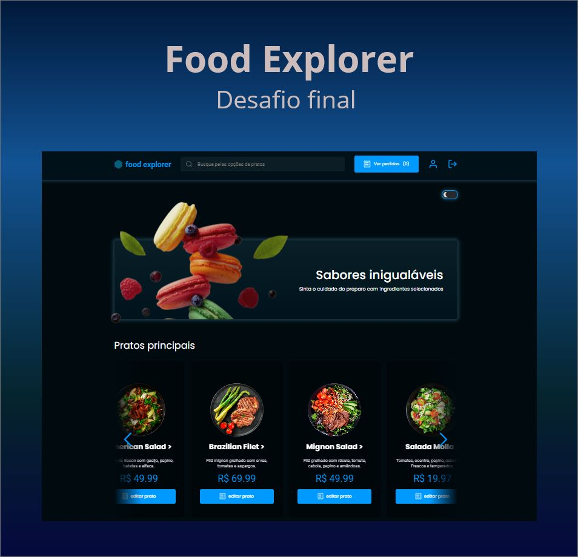

<p align="center">
  <h1 align="center"><a href="https://food-explorer-vasc-333.netlify.app/">🍴 Food Explorer 🍴</a></h1>
</p>



## About the project 📝

Food Explorer is a complete online platform for restaurants, offering customers a comprehensive ordering and tracking experience. With registration, order creation and status tracking features, users can easily place their orders and monitor their choices. Profile customization, favourites filtering and the search function all contribute to making the experience more practical and tailored to each customer.

The fully functional shopping cart allows users to select the items they want and choose between two payment options: card or Pix. This flexibility makes the payment process more convenient for customers.

The role of the Administrator is vital on the platform, as they have the ability to manage the restaurant's menu, adding, editing and removing dishes as necessary. In addition, the administrator can change the status of orders to reflect the preparation process in the kitchen, and these updates are immediately visible to consumers.

The project also incorporates additional features, such as the option to customize the page theme, allowing users to adjust the appearance of the platform according to their preferences. In addition, the customization of the user profile, including image, name and password, provides a more individualized experience.

Finally, Food Explorer's responsive adaptation for different types of devices is an important feature, allowing users to conveniently access and use the platform on smartphones, tablets and computers.</p>

</br>

## Technologies used in this project 🛠️

- [HTML](https://developer.mozilla.org/pt-BR/docs/Web/HTML)
- [CSS](https://developer.mozilla.org/pt-BR/docs/Web/CSS)
- [StyledComponents](https://styled-components.com)
- [JWT](https://jwt.io)
- [Express](https://expressjs.com)
- [SQLite](https://www.sqlite.org/docs.html)
- [Knex](https://knexjs.org/)
- [ReactJS](https://react.dev/)
- [NodeJS](https://nodejs.org/docs/latest/api/)

</br>

## ❓ How can I use it?

</br>
<h2>1. Clone the project to your computer.</h2>

```bash
$ git clone git@github.com:holices/food-explorer
```

<br>

<h2>2. With the project open in an IDE, navigate to the foodexplorer-backend directory and run the commands:.</h2>

```bash
# Install the packages needed to run the project
$ npm install
```

```bash
# Run the database
$ npm run dev
```
<br>

<h2>3. Now go back to the root directory and access the foodexplorer-frontend folder and run it:</h2>

```bash
# Install the packages needed to run the project
$ npm install
```

```bash
# Run the frontend
$ npm run dev
```
<br>


🔑 To run the test through Admin, use the following account:</br>

e-mail: admin@foodexplorer.com </br>
password: 123456

---

The front-end was hosted directly on Netlify. It's important to note that for the front-end to work perfectly,
the backend server must be responding and working correctly.

NOTE: Due to hosting on a free service, the backend goes into a hibernation state after 15 minutes of non-use. Therefore, there may be a delay of up to 1 minute, depending on the load on Render's servers.
